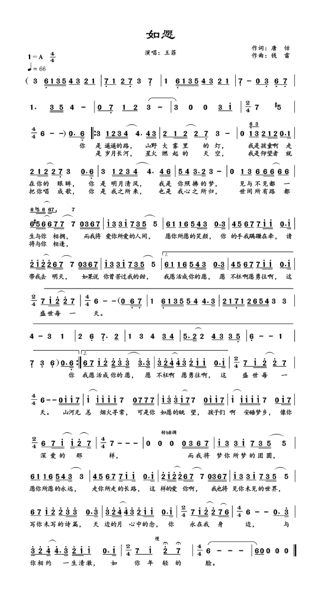

# 清明节

2023年04月05日

怀念我的父亲。 
近日口腔溃疡越发严重，无法给父亲吹口琴。 
口琴曾是父亲的爱好，我虽没听过他的口琴声，但是我现在却喜欢，这可能就是冥冥中注定的血液里的遗传吧。 
父亲操劳一生，却没机会来杭州。他曾经想去很多地方，也没能去，以后有机会我替他去。 
 
如愿 
作曲：钱雷 
作词：唐恬 
演唱：王菲 
 
分享王菲的MV **[《如愿（电影《我和我的父辈》主题曲）》](https://fn.music.163.com/g/mlog/mlog-mobile/landing/mv?app_version=8.9.61&id=14360887&userid=106178932&dlt=0846)**
 

<table style="font-size: 14px; text-align:center">
    <tr>
        <td width="50%">
            
   
            你是 遥遥的路 
            山野大雾里的灯 
            我是孩童啊 走在你的眼眸 
             
            你是 明月清风 
            我是你照拂的梦 
            见与不见都一生 与你相拥 
             
            而我将 爱你所爱的人间 
            愿你所愿的笑颜 
            你的手我蹒跚在牵 
            请带我去明天 
             
            如果说 你曾苦过我的甜 
            我愿活成你的愿 
            愿不枉啊 愿勇往啊 
            这盛世每一天 
             
            ***    
            

        </td>
        <td width="50%">
            

            你是 岁月长河 
            星火燃起的天空 
            我是仰望者 就把你唱成歌 
             
            你是 我之所来 
            也是我心之所归 
            世间所有路都将 与你相逢 
             
            而我将 爱你所爱的人间 
            愿你所愿的笑颜 
            你的手我蹒跚在牵 
            请带我去明天 
             
            如果说 你曾苦过我的甜 
            我愿活成你的愿 
            愿不枉啊 愿勇往啊 
            这盛世每一天 
             
            ***    
            

        </td>
    </tr>
    <tr>
        <td colspan="2">
            

            山河无恙 烟火寻常 
            可是你如愿的眺望 
            孩子们啊 安睡梦乡 
            像你深爱的那样 
             
            而我将 梦你所梦的团圆 
            愿你所愿的永远 
            走你所走的长路 
            这样的爱你啊 
             
            我也将 见你未见的世界 
            写你未写的诗篇 
            天边的月 心中的念 
            你永在我身边 
             
            与你相约 一生清澈 
            如你年轻的脸 
            

        </td>
    </tr>
    <tr>
        <td colspan="2">
            
        </td>
    </tr>
</table>

曲作者钱雷，《默》《大鱼》《用尽我的一切奔向你》《岁月》《孤勇者》《光亮》等大热歌曲都是他的作品。 
词作者唐恬，罹患癌症多年，这让她格外珍惜平凡生活中的希望与美好，《人世间》《孤勇者》等歌曲的词也是她的作品。

