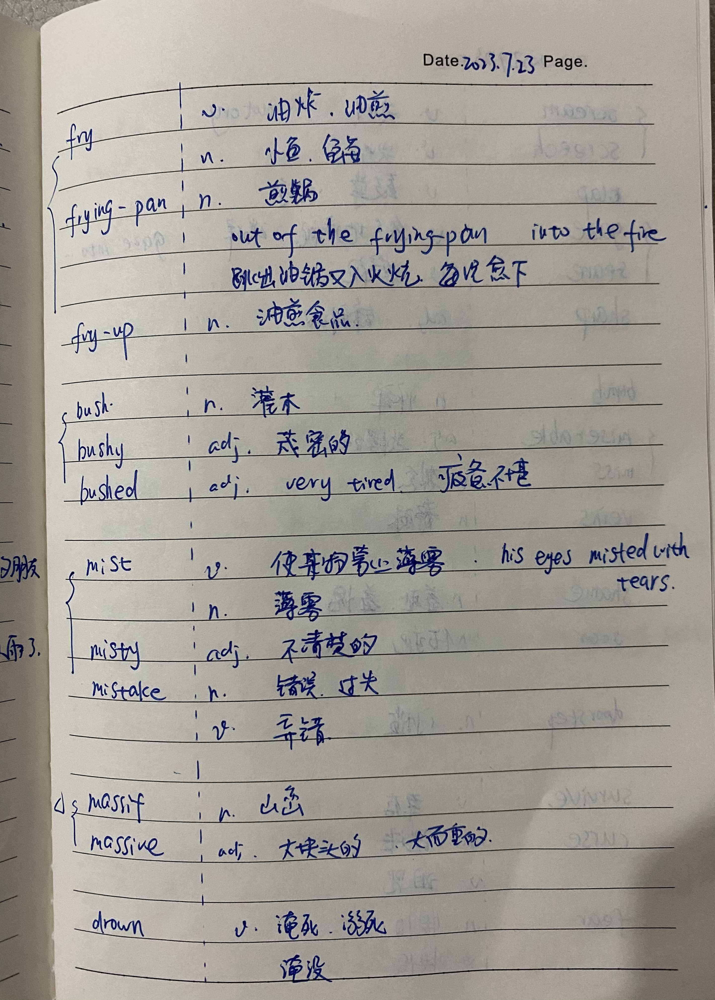
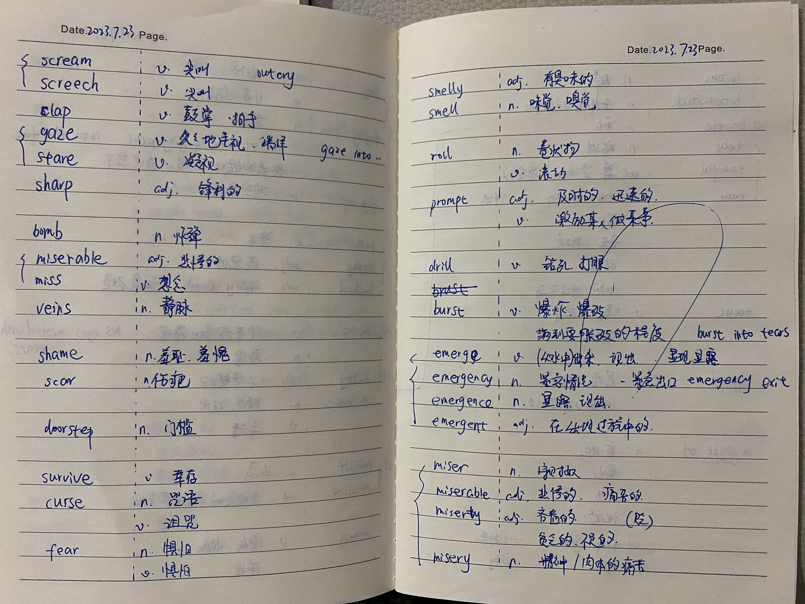
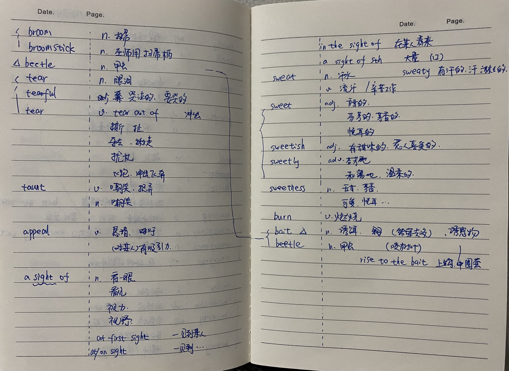

# 学习的脚步不能停歇

2023年07月23日

### 漫长的季节
早上5点醒来，继续我的哈利波特 第一章 
之前看到那么多单词很是头大，但是总是要开始呀。 
想想自己是学计算机的，但是英文不过关，这不是明摆着的短板么？ 
老母亲为了学英语也是拼了，从昨晚到今早，终于把第一章看完了。 
虽然感觉是漫长的季节，但是看完的那瞬间，还是很满足的。 

当时为了学单词(目标是 10000-20000 单词)，还想报个课（李靖瑜单词） 
从讲的公开课来看，我只找到了老师讲过的2个单词：bait (诱饵)、beetle（甲虫）(参考2023.07.22.Words的笔记) 
套用我学到的一句话： 
Harry knew he shouldn't have risen to Dudley’s bait。 
这时候我只想对自己说： 
I knew i have risen to the bait。 

你只管读就是了，难道要为了先认识单词而花半年或一年的时间么？有这些时间不是早就读完了么？ 
不管用什么方法，功夫总是要下的。 

读完了，笔记不能少，用老公的话说：学霸一支笔，咱也冒充一回学霸 

    
    
    

